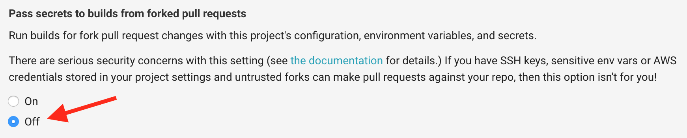

# @cypress/env-or-json-file

> Loads JSON object from environment string or local file

[![NPM][npm-icon] ][npm-url]

[![Build status][ci-image] ][ci-url]
[![semantic-release][semantic-image] ][semantic-url]
[![js-standard-style][standard-image]][standard-url]

## Install

Requires [Node](https://nodejs.org/en/) version 6 or above.

```sh
npm install --save @cypress/env-or-json-file
```

## Use

If you have configuration file locally `foo.json` with all your settings,
load it directly

```js
const {configFromEnvOrJsonFile} = require('@cypress/env-or-json-file')
const config = configFromEnvOrJsonFile('foo.json')
if (config) {
  // ok, loaded somehow
} else {
  console.error('Missing config...')
}
```

But when you move to CI, just grab the file's contents and put it as
environment variable `foo_json` (environment variables often have restrictions
on characters, so replace all `/.-` characters in the path with `_`)

```sh
cat foo.json | pbcopy
```

Paste the contents into CI variable `foo_json` and it should load the config
on CI without checking in a sensitive file.

## Debug

To see verbose log message from this module, run with
`DEBUG=env-or-json-file ...` environment variable.

## Filename

Given a filename with path, function `filenameToShellVariable` converts it to
environment key name, normalizing slashes and dots.

```js
const {filenameToShellVariable} = require('@cypress/env-or-json-file')
filenameToShellVariable('foo/bar/.me.json')
// foo_bar__me_json
```

## Tips

* To prevent committing sensitive files use
  [ban-sensitive-files](https://github.com/bahmutov/ban-sensitive-files)
* Make sure CI does NOT leak environment variables to forks, like
  [CircleCI does](https://circleci.com/docs/1.0/fork-pr-builds/)



### Small print

License: MIT - do anything with the code, but don't blame us if it does not work.

Support: if you find any problems with this module, email / tweet /
[open issue](https://github.com/cypress-io/env-or-json-file/issues) on Github

## MIT License

Copyright (c) 2017 Cypress.io

Permission is hereby granted, free of charge, to any person
obtaining a copy of this software and associated documentation
files (the "Software"), to deal in the Software without
restriction, including without limitation the rights to use,
copy, modify, merge, publish, distribute, sublicense, and/or sell
copies of the Software, and to permit persons to whom the
Software is furnished to do so, subject to the following
conditions:

The above copyright notice and this permission notice shall be
included in all copies or substantial portions of the Software.

THE SOFTWARE IS PROVIDED "AS IS", WITHOUT WARRANTY OF ANY KIND,
EXPRESS OR IMPLIED, INCLUDING BUT NOT LIMITED TO THE WARRANTIES
OF MERCHANTABILITY, FITNESS FOR A PARTICULAR PURPOSE AND
NONINFRINGEMENT. IN NO EVENT SHALL THE AUTHORS OR COPYRIGHT
HOLDERS BE LIABLE FOR ANY CLAIM, DAMAGES OR OTHER LIABILITY,
WHETHER IN AN ACTION OF CONTRACT, TORT OR OTHERWISE, ARISING
FROM, OUT OF OR IN CONNECTION WITH THE SOFTWARE OR THE USE OR
OTHER DEALINGS IN THE SOFTWARE.

[npm-icon]: https://nodei.co/npm/@cypress/env-or-json-file.svg?downloads=true
[npm-url]: https://npmjs.org/package/@cypress/env-or-json-file
[ci-image]: https://travis-ci.org/cypress-io/env-or-json-file.svg?branch=master
[ci-url]: https://travis-ci.org/cypress-io/env-or-json-file
[semantic-image]: https://img.shields.io/badge/%20%20%F0%9F%93%A6%F0%9F%9A%80-semantic--release-e10079.svg
[semantic-url]: https://github.com/semantic-release/semantic-release
[standard-image]: https://img.shields.io/badge/code%20style-standard-brightgreen.svg
[standard-url]: http://standardjs.com/
